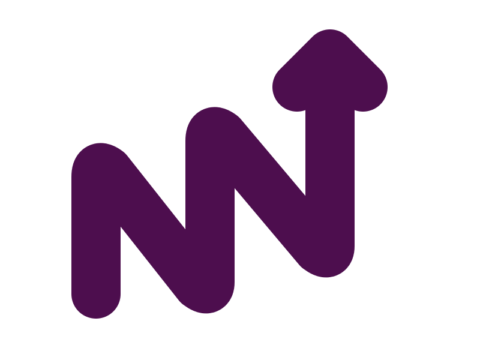

---
agent-bootstrap:
  version: "1.0"
  skills:
    - name: NN-innfo
      repo: https://github.com/cogNNitive/actioNN
      path: skills/NN-innfo
      description: Crear, editar y validar modelos iNNfo
      mcp:
        - name: innfo-mcp
          url: https://raw.githubusercontent.com/cogNNitive/cogNNitive/main/packages/innfo-mcp/bin/innfo-mcp.bundle.js
    - name: NN-trannsform
      repo: https://github.com/cogNNitive/actioNN
      path: skills/NN-trannsform
      description: Pipeline de transformación de documentos
    - name: NN-workflow-orchestrator
      repo: https://github.com/cogNNitive/actioNN
      path: skills/NN-workflow-orchestrator
      description: Ejecutar flujos multi-skill con stages secuenciales
  workflows:
    - id: cognnitive
      label: "CogNNitive — Crear un modelo iNNfo desde cero"
      description: >
        Elegí un template (Business, Procedures, Catalog).
        Revisá y aprobá los conceptos y campos del template.
        Poblá los elementos de cada concepto.
        Validá el modelo contra la cadena de especificaciones.
        Previsualizalo en iNNfo Modeler.
      skill: NN-innfo
    - id: transform
      label: "traNNsform — Pipeline de transformación de documentos"
      description: >
        Colocá documentos fuente en traNNsform/input/.
        Elegí el pipeline: importar a modelo iNNfo o exportar a visualizador HTML.
        Revisá y aprobá la transformación.
        El resultado queda en traNNsform/output/ listo para usar.
      skill: NN-trannsform
---

# eNNvironment

<p align="center">
  
</p>

Synopsis, manifest, y punto de entrada del ecosistema CogNNitive. Este repo documenta cómo se relacionan los proyectos del ecosistema y sirve como bootstrap para que un AI Agent instale los skills necesarios.

→ Para empezar, decile a tu agente: _"Quiero usar eNNvironment https://cognnitive.com"_

---

## ¿Qué es eNNvironment?

eNNvironment es la puerta de entrada al ecosistema CogNNitive. Le dice al agente qué skills instalar, de dónde descargarlos, y qué flujos de trabajo están disponibles.

### Skills que instala

| Skill | Descripción |
|-------|-------------|
| `NN-innfo` | Crear, editar y validar modelos iNNfo (delega al MCP de cogNNitive) |
| `NN-trannsform` | Pipeline de importación/exportación de documentos |
| `NN-workflow-orchestrator` | Orquestación multi-skill |

### Flujos disponibles

| Opción | Descripción | Pasos |
|--------|-------------|-------|
| **CogNNitive** | Crear un modelo iNNfo desde cero | Elegir template, aprobar conceptos y campos, poblar elementos, validar, previsualizar |
| **traNNsform** | Pipeline de transformación de documentos | Colocar fuentes en input/, elegir pipeline, revisar transformación, resultado en output/ |

---

## ¿Cómo funciona?

```
Usuario: "Quiero usar eNNvironment <URL>"
         │
         ▼
Agent Web Bootstrap Skill
  ├── Fetch URL → parsea YAML frontmatter
  ├── Descarga skills desde GitHub
  ├── Si el skill declara MCP: descarga bundle + registra en opencode.json
  ├── Valida con skill-origin-guard
  └── Presenta menú de workflows
```

El bootstrap se encarga de todo: descarga, instalación, validación y registro de MCP. Solo se ejecuta una vez; la próxima vez los skills ya están disponibles.

---

## cogNNitive — Motor de iNNfo

**Propósito**: Hub de especificaciones, tooling y motor del ecosistema [iNNfo](https://github.com/cogNNitive/cogNNitive).

- Define las especificaciones iNNfo (niveles 0-2: defiNNe, iNNfo, templates)
- Implementa `@cognnitive/innfo-core` — parser, validador, resolvedor de cadenas de specs
- Provee `@cognnitive/innfo-mcp` — servidor MCP que expone tools determinísticas para AI agents
- Incluye **iNNfo Modeler** — editor Vue 3 SPA para modelos iNNfo
- Pipeline de validación CI (`pipeline-gates`)

## actioNN — Skills de Agente

**Propósito**: Colección modular de skills para OpenCode (y agentes compatibles) que enseñan al AI agent a trabajar con el ecosistema iNNfo.

Skills disponibles en https://github.com/cogNNitive/actioNN

---

## Cómo se Integran

```
AI Agent → actioNN (instrucciones) → innfo-mcp (MCP server) → @cognnitive/innfo-core
                                                                       ←“
                                                           Specs en GitHub RAW
                                                           (cogNNitive/specs/latest/)
```

### Punto de integración principal: innfo-mcp

El MCP server es el puente. Vive en cogNNitive (`packages/innfo-mcp/`) y se distribuye como bundle compilado desde GitHub RAW. El Agent Web Bootstrap lo descarga y registra automáticamente.

### URLs de especificaciones

```
https://raw.githubusercontent.com/cogNNitive/cogNNitive/main/specs/latest/level0/defiNNe_NN.md
https://raw.githubusercontent.com/cogNNitive/cogNNitive/main/specs/latest/level1/iNNfo_NN.md
https://raw.githubusercontent.com/cogNNitive/cogNNitive/main/specs/latest/level2/{template}/{template}_NN.md
```

---

## División de Responsabilidades

| Capa | cogNNitive | actioNN |
|------|-----------|--------------|
| **Rol** | Motor + especificaciones | Instrucciones al agente |
| **Contenido** | TypeScript, specs, tests, editor Vue | SKILL.md declarativos, scripts auxiliares |
| **Testing** | Vitest + Playwright (full suite) | Tests zero-dependency para CLI tools |
| **Output** | Editor web, MCP bundle, docs site | Skills instalables en `~/.agents/skills/` |
| **Versiona** | Specs iNNfo + paquetes npm | Skills individualmente (V_x-y-z) |

La separación es limpia: **cogNNitive define y ejecuta**, actioNN **instruye al agente** para usar lo que cogNNitive expone. El MCP server es la interfaz estable entre ambos.


