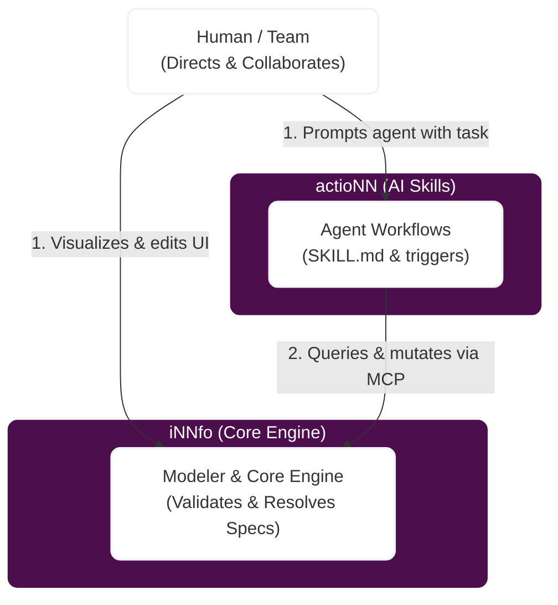

# cogNNitive — Bridge Your Organizational Knowledge to AI Agents

Build structured, valid, and executable knowledge models. cogNNitive is a decentralized, file-based modeling framework that turns plain Markdown documentation into a machine-readable, validated knowledge base.

## Co-operating in the Ecosystem: actioNN & iNNfo

The ecosystem separates what the agent **knows** (iNNfo) from how the agent **acts** (actioNN).

---

## Why cogNNitive? The Business Value

Current documentation is either **static** (buried in Notion/Confluence where it goes out of date) or **unstructured** (unreadable by AI agents without hallucinations). cogNNitive solves this by creating a **validated, executable knowledge base**:

*   **A Single Source of Truth for Humans and AI:** Write requirements, business models, and operations in plain Markdown. Both human team members and AI coding assistants read and update the same Git-tracked files.
*   **Zero Hallucinations:** AI agents interact with your models through a structured Model Context Protocol (MCP) server, validating every change against schema templates.
*   **Continuous Compliance:** Built-in validation rules run in CI/CD pipeline gates, ensuring no invalid requirements, dead links, or broken processes reach production.

---

## How it Works: Creating Models with iNNfo

Building a collaborative knowledge base with iNNfo takes just four simple steps:

1.  **Initialize the Workspace:** Set up a standard Git directory with an `index.md` for navigation and a `_templates/` folder specifying your business schemas.
2.  **Draft your Models (`*_NN.md`):** Write your specs, teams, or procedures in clean Markdown. Use standard YAML frontmatter at the top to declare properties like version, author, and parent template.
3.  **Link Concepts Together:** Connect your files using standard wikilinks `[[concept-name]]` to form a unified, highly navigable knowledge graph.
4.  **Instant Validation:** Open the folder in the **iNNfo Modeler** web app or run your AI agent. The core engine validates the model tree instantly, highlighting inconsistencies or missing fields.

---

## Ecosystem Repositories

| Repo | Role | Description |
|------|------|-------------|
| **[eNNvironment](https://github.com/cogNNitive/eNNvironment)** | Gateway | The entry point and manifest. Tells agents what skills and workflows are available. |
| **[iNNfo](https://github.com/cogNNitive/iNNfo)** | Engine | The core. Contains the TS parser, validator, MCP server, and browser editor. |
| **[actioNN](https://github.com/cogNNitive/actioNN)** | Skills | Modular agent skills and instructions that teach agents how to execute workflows. |

---

## Frequently Asked Questions (FAQ)

### How does cogNNitive compare to Obsidian?
**Obsidian** is a personal note-taking app designed for individuals. While you can open and edit iNNfo's markdown files in Obsidian (which is great!), Obsidian itself does not enforce schema rules, validate structural consistency, or have a native protocol for AI agents to write back changes programmatically. **cogNNitive** is designed for teams collaborating with AI, adding validation, templates, and agent connectivity to standard markdown files.

### How does cogNNitive compare to Notion or Confluence?
**Notion** and Confluence are centralized, proprietary wikis. Your data is locked in a vendor's database, and integrating custom AI agents requires complex API setups and expensive fees. **cogNNitive** is decentralized and file-based. Your knowledge catalog lives in your Git repository under absolute ownership. AI agents can access it locally via MCP, and changes are committed directly to version control.

### Do I need to use the iNNfo Modeler?
No. Since it's plain Markdown, you can write and edit models in VS Code, Obsidian, Vim, or any editor you prefer. The **iNNfo Modeler** (inside the `iNNfo` repo) is a browser utility that parses your workspace folder locally to give you instant validation feedback, graph visualizations, and tabular matrix views.

---

## Getting Started

1.  **Install OpenCode Desktop** — Download the desktop application from [opencode.ai/download](https://opencode.ai/download)
2.  **Tell your agent** — Say: `I want to use https://cognnitive.com/use`
3.  **Choose & follow** — Pick what you want and follow the instructions
